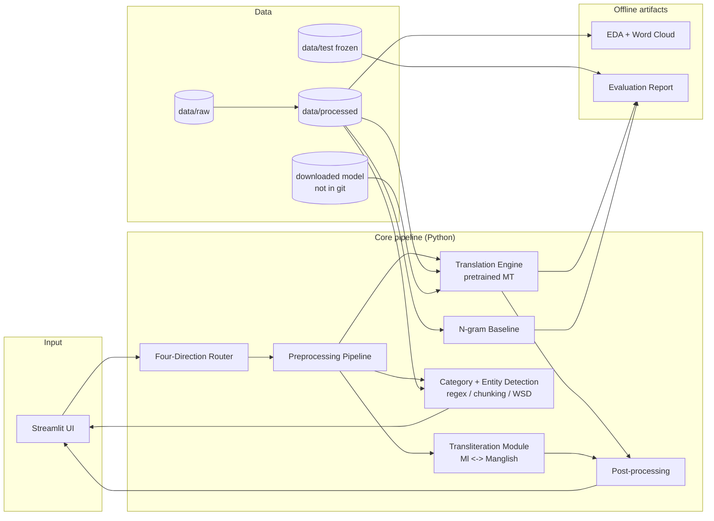
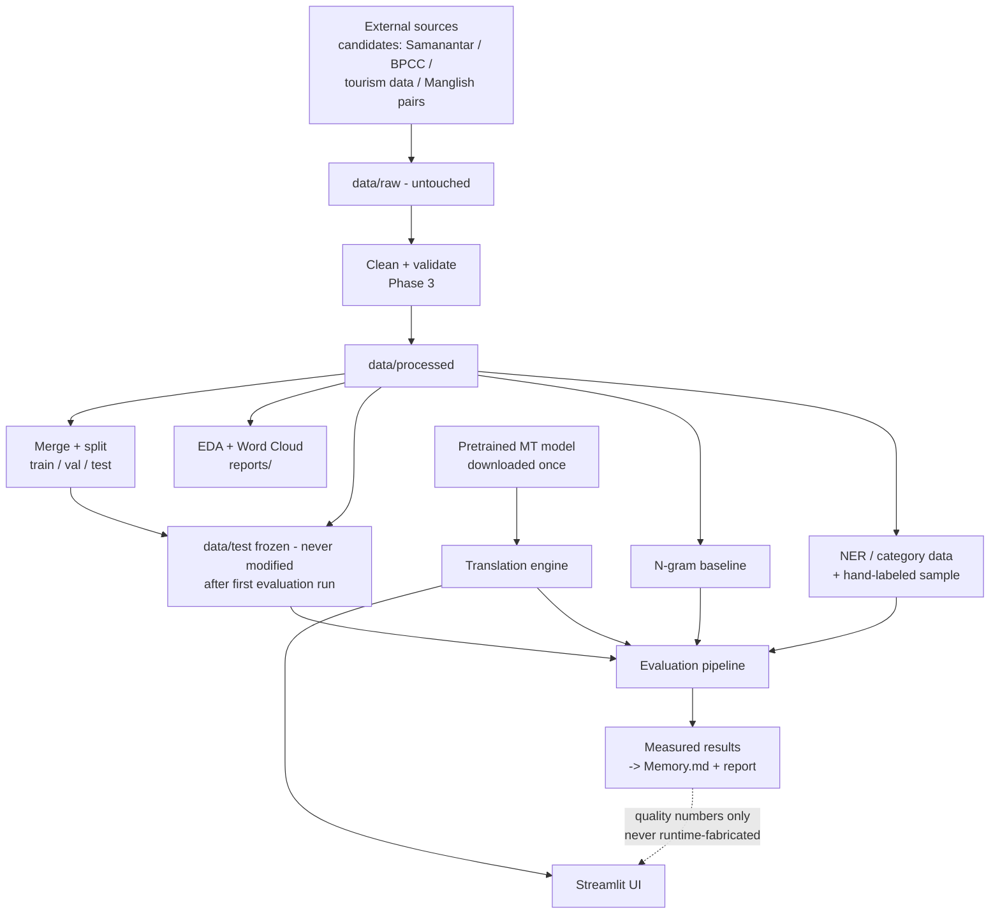
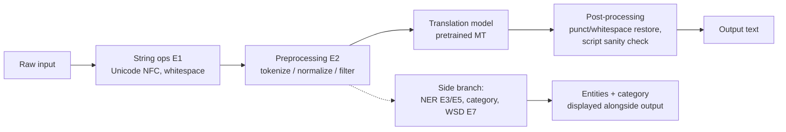
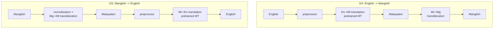
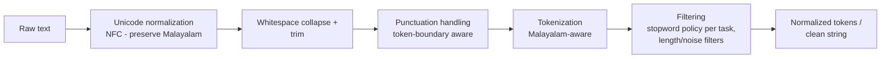
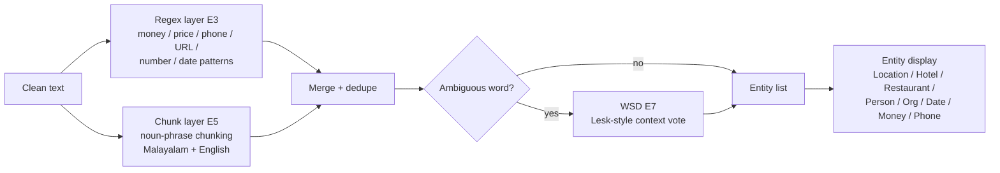
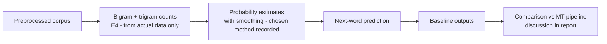
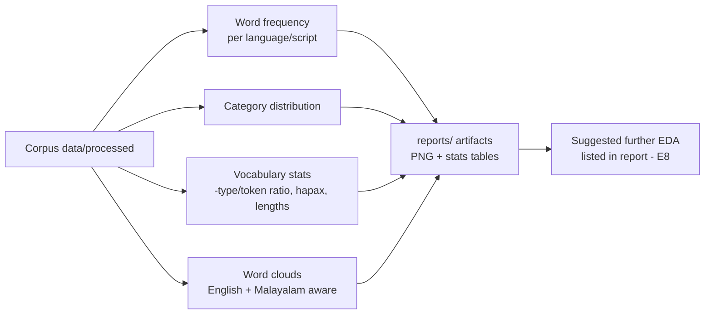
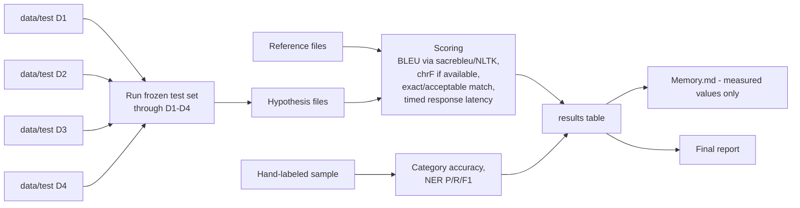

# Architecture — Malayalam Tourist Translation & Transliteration System

| | |
|---|---|
| **Status** | Documentation phase — the architecture below is **planned**; no components are implemented yet |
| **Created** | 2026-09-30 |
| **Companion docs** | `PRD.md` (requirements), `Phases.md` (build order), `Rules.md` (constraints), `Design.md` (UI) |

---

## 1. High-level architecture



Design principles:

- **One shared preprocessing path** — the same cleaning/normalization code serves translation input, NER, the n-gram
  baseline and evaluation (no per-module reinvented cleaning).
- **Composition over complexity** — Manglish directions are *composed* from a translation step and a transliteration
  step; there is no separate "Manglish translation model".
- **Pretrained core** — sequence-to-sequence translation is delegated to a pretrained multilingual model
  (candidate: IndicTrans2 family); everything around it is course-NLP tooling the team writes.
- **Offline-first** — no network calls at runtime; model and datasets are downloaded once, then everything runs
  locally.

## 2. System components

| # | Component | Responsibility | Course experiments |
|---|---|---|---|
| CP-1 | String ops module | Unicode-safe text operations, word counting, case handling, Malayalam preservation | E1 |
| CP-2 | Preprocessing pipeline | Tokenization, normalization, filtering, punctuation/whitespace handling | E2 |
| CP-3 | Regex pattern library | Numbers, prices, currency, phone numbers, URLs | E3 |
| CP-4 | N-gram baseline | Bigram/trigram counts, next-word prediction, LM baseline | E4 |
| CP-5 | Chunker + entity extractor | Noun-phrase chunking; location/hotel/restaurant/person/org/date/money entities | E5 |
| CP-6 | HMM/Viterbi POS tagger | *Optional* sequence-model component — included only if it demonstrably helps | E6 |
| CP-7 | WSD module | Lesk-style sense disambiguation for ambiguous tourism words | E7 |
| CP-8 | EDA pipeline | Word frequency, word clouds, category distribution, vocabulary analysis | E8 |
| CP-9 | Translation engine | Wrapper around the pretrained MT model (load, translate, unload) | — (uses E1/E2) |
| CP-10 | Transliteration module | Malayalam ↔ Manglish conversion and Manglish normalization | E1/E2 |
| CP-11 | Four-direction router | Composes CP-9/CP-10 into D1–D4 | — |
| CP-12 | Category detector | Tourism category classification (keyword/rule baseline; statistical option later) | E2/E5 |
| CP-13 | Evaluation pipeline | BLEU/chrF/exact match/NER F1/response time over frozen test sets | uses all |
| CP-14 | Streamlit UI | Direction selector, input, result, category, entity display, error/loading states | — |

## 3. Data flow



Key data rules: `data/raw/` is immutable · splits are created once and frozen · the evaluation test set lives in
`data/test/` and never changes after the first scored run · downloaded models are never committed.

## 4. Translation pipeline

Direct translation (D1/D2) — the general shape:



| Direction | Route (spec-mandated) |
|---|---|
| **D1** En → Ml | English → preprocessing → translation model → Malayalam → post-processing |
| **D2** Ml → En | Malayalam → preprocessing → translation model → English → post-processing |

## 5. Manglish pipeline

Manglish is **Romanized Malayalam** — every Manglish route passes through Malayalam:



| Direction | Route (spec-mandated) |
|---|---|
| Malayalam → Manglish | Malayalam → transliteration → Manglish (building block for D4) |
| **D4** En → Manglish | En→Ml translation → Ml→Mg transliteration → Manglish |
| **D3** Manglish → En | Mg→Ml normalization/transliteration → Ml→En translation → English |

No component treats Manglish as an independent language; there is no direct English↔Manglish model.

## 6. Preprocessing pipeline

Shared by every module (E2, built on E1 string ops):



Rules of note (details in `Rules.md` §8):

- One implementation, used everywhere (translation input, corpus building, NER, n-grams, evaluation).
- Malayalam tokenization must be script-aware (Malayalam word boundaries + chillra/virama handling); a naive
  `split()` is insufficient — Unicode-aware tokenization from NLTK/regex `\w+` with Unicode flags is the planned
  baseline, refined if tests show breakage.
- Cleaning for *translation input* must be lighter than cleaning for *corpus statistics* — both come from the same
  module with a `mode` parameter, never from separate divergent copies.

## 7. NER pipeline



- Entity types (per PRD FR-6): locations, hotels, restaurants, people, organizations, dates, money, phone numbers,
  prices, URLs.
- The regex layer (E3) and chunking layer (E5) are complementary; overlap is resolved by a documented merge policy
  (first-match/priority order — **DECISION REQUIRED** in Phase 8, recorded in `Memory.md`).
- Evaluation: precision/recall/F1 against a hand-labeled sample (Phase 13), never assumed.

## 8. WSD pipeline

Lesk-style disambiguation, applied where it can change an outcome:

```mermaid
flowchart LR
    A[Ambiguous word\nexample: bank / charge / room / train] --> B[Collect context window\nfrom sentence]
    B --> C[Expand candidate senses\ngloss inventory - planned source:\nWordNet-style lexical glosses]
    C --> D[Overlap scoring\nsignature vs context\n(LESK algorithm)]
    D --> E[Selected sense]
    E --> F{Sense affects\ntranslation/entity?}
    F -->|yes| G[Flag + disambiguated output\ne.g. hotel 'room' vs 'living room']
    F -->|no| H[Pass through unchanged]
```

- Demonstrating ambiguity (same surface word, different senses, context-dependent outcome) is a required demo in the
  final presentation (PRD E7 row).
- WSD is **support**, not the centerpiece: if a sense does not affect the tourism translation or entity result, that
  is recorded honestly rather than over-claimed (Rules §10).

## 9. N-gram baseline



- Counts come exclusively from the collected corpus — no hardcoded probabilities (Rules §11).
- The baseline serves two purposes: (a) FR-12 next-word prediction demo; (b) a language-model reference point when
  discussing translation fluency in the report.

## 10. EDA pipeline



Outputs are files under `reports/` (matplotlib; Malayalam-capable font required for rendered text — see
`Design.md` §13 for the font strategy; missing-glyph boxes are a known matplotlib risk and must be checked in
Phase 6 validation).

## 11. Evaluation pipeline



- Test sets are frozen before the first run (PRD §12).
- Metric configuration recorded alongside every result for reproducibility.
- Response time measured per direction with hardware noted.

## 12. Suggested technology stack

Exactly the spec-recommended stack — no additional technologies:

| Layer | Technology | Used for |
|---|---|---|
| Language | Python 3.10+ | everything |
| Data handling | Pandas | corpus tables, result tables |
| NLP basics | NLTK | tokenization, corpora helpers, BLEU (NLTK), n-gram utilities |
| Chunking/NER assist | spaCy *where appropriate* | chunking baseline / English-side NLP (only where it earns its place) |
| Translation model | Hugging Face Transformers (+ PyTorch) | loading/running the pretrained MT model (candidate: IndicTrans2) |
| Deep learning runtime | PyTorch | model inference |
| UI | Streamlit | application interface |
| Charts/word cloud | Matplotlib | EDA figures, word clouds |
| Evaluation | SacreBLEU (preferred) / NLTK BLEU | BLEU (+ chrF where the tool provides it) |
| Testing | Python `unittest` (stdlib) | no extra dependency |

Everything else (regex = stdlib `re`; Unicode = stdlib `unicodedata`; timing = `time`) comes from the standard
library. Adding databases, message queues, containers, cloud services, or web frameworks beyond Streamlit is
**out of scope** (`Rules.md` §14 / PRD Non-goals).

## 13. Dataset structure

Spec-mandated layout:

```
data/
├── raw/                      # immutable downloads, one subfolder per source
│   ├── general_parallel/
│   ├── tourism/
│   └── manglish_pairs/
├── processed/                # cleaned outputs; same tree as raw
├── tourism/                  # tourism-domain parallel data (post-merge)
└── test/                     # FROZEN test sets, one file set per direction
    ├── d1_en_ml/
    ├── d2_ml_en/
    ├── d3_mg_en/
    └── d4_en_mg/
```

Each dataset carries a sidecar record (name, source, license, sentence-pair count, preprocessing applied, split
sizes) once actually collected — recorded in `Memory.md` § Dataset. `data/raw/` is never edited in place.

## 14. Folder structure

```
NLP mini/                          # repository root
├── AGENTS.md                      # AI session instructions
├── PRD.md                         # requirements
├── Architecture.md                # this file
├── Rules.md                       # development rules
├── Phases.md                      # 17-phase plan
├── Design.md                      # UI design
├── Memory.md                      # persistent project state (created; updated each phase)
├── data/                          # (Phase 2+) see §13
│   ├── raw/  processed/  tourism/  test/
├── src/                           # (Phase 1+) all modules
│   ├── config.py                  # paths, categories, language tags - single source of truth
│   ├── preprocessing/             # text_ops.py (E1), tokenizer.py (E2), clean.py
│   ├── patterns/                  # regex.py (E3)
│   ├── ngram/                     # builder.py, predictor.py (E4)
│   ├── ner/                       # chunker.py (E5), extractor.py (E3+E5)
│   ├── pos/                       # hmm_tagger.py (E6, optional - see Rules §11)
│   ├── wsd/                       # lesk.py (E7)
│   ├── eda/                       # stats.py, wordcloud.py (E8)
│   ├── translation/               # engine.py, postprocess.py
│   ├── transliteration/           # ml_to_mg.py, mg_to_ml.py
│   ├── pipeline/                  # directions.py - four-direction router
│   ├── evaluation/                # bleu.py, metrics.py, timing.py
│   └── ui/                        # app.py - Streamlit
├── notebooks/                     # optional exploratory notebooks (EDA drafts)
├── reports/                       # generated artifacts: EDA figures, eval tables
├── tests/                         # unittest suites, mirrors src/ layout
├── scripts/                       # run_*.py entrypoints (download data, run eval, launch UI)
└── models/                        # downloaded model files - gitignored, never committed
```

`.gitignore` (Phase 1) must exclude: `data/raw/`, `data/processed/` (or large parts of it), `models/`, generated
`reports/` binaries as appropriate, `__pycache__/`, `.venv/`. Small curated `data/test/` files and `data/sample/`
fixtures **are** committed so tests run from a clean checkout.

## 15. Module responsibilities

| Module | Owns | Must not do |
|---|---|---|
| `src/config.py` | All shared constants: paths, category list, language tags, seeds | Contain logic or I/O side effects |
| `src/preprocessing/` | E1 string ops + E2 cleaning/tokenizing, `mode` parameter for translation vs corpus | Know about models or UI |
| `src/patterns/` | E3 regex library, compiled patterns, match extraction | Hardcode entity *labels* that regex cannot support |
| `src/ngram/` | Count building, smoothing, next-word prediction from data | Use any hardcoded probability table |
| `src/ner/` | Chunker + extractor + merge policy | Claim accuracy without evaluation |
| `src/pos/` | Optional HMM/Viterbi tagger (E6) | Be wired into translation unless Phase 9 proves benefit |
| `src/wsd/` | Lesk implementation + sense gloss inventory + demonstration cases | Over-claim impact not shown in evaluation |
| `src/eda/` | Statistics + word-cloud generation to `reports/` | Modify `data/` in place |
| `src/translation/` | Model loading/inference + post-processing; honest failure if model missing | Fabricate output on failure; claim model was trained by the team |
| `src/transliteration/` | Ml↔Mg conversion + Manglish normalization (single normalization scheme) | Treat Manglish as an independent language |
| `src/pipeline/directions.py` | Compose D1–D4 routes exactly as spec'd | Add hidden steps not documented here |
| `src/evaluation/` | Scoring, timing, result serialization | Write results anywhere except reports + `Memory.md` |
| `src/ui/app.py` | Streamlit interface per `Design.md` | Run heavy training/evaluation at page load; fabricate outputs |

---

*Everything in this document is a plan. Components exist only as specified until their phase in `Phases.md` is
reached and validated.*
